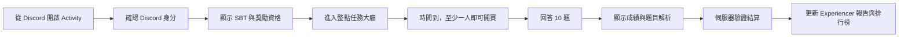

# twin3 Community Mission 產品規劃書

版本：V2 委員會整合版
產品終局：Discord 內的 twin3 多人知識遊戲  
目前階段：公開 Web 試玩版

## 1. 產品定位

Community Mission 是 twin3 的定時社群任務。

它用短時間知識遊戲達成三個目的：

1. **理解**：讓成員真正理解 Twin Matrix、Humanity、Agent 與 Proof of Contribution。
2. **參與**：建立每小時都能加入的社群儀式，讓單人與多人都能完成。
3. **證明**：把可驗證的學習參與記入 Experiencer 貢獻，但不把單純記憶題庫等同於高價值貢獻。

正式產品不是「答題領幣網站」，而是：

> **Discord 內可共同進行、可學習、可驗證、可持續更新的 Twin Matrix 任務遊戲。**

## 2. 產品邊界

Community Mission 可以證明：

- 玩家使用哪個 Discord 身分參與。
- 玩家完成哪一場任務。
- 玩家對哪些題目作答。
- 玩家是否第一次掌握該題目版本。
- 該事件是否符合 Experiencer `$PoC` 結算條件。

Community Mission 不能單獨證明：

- 玩家是唯一真人。
- 玩家對 twin3 有完整理解。
- 玩家已完成其他角色的貢獻。
- 玩家答題速度代表貢獻價值。

真人與獎勵資格仍以 twin3 canonical identity 與 Twin Matrix SBT 為準。

## 3. 目前真實狀態

| 項目 | 現況 |
|---|---|
| 公開試玩 | 已上線 |
| 題庫 | **5 題** |
| 每場題數 | **5 題，固定題目** |
| 題目與答案 | 目前都在前端，僅適合展示 |
| Discord 登入 | 尚未完成 |
| 真實玩家連線 | 尚未完成，目前為模擬房間 |
| 真實排行榜 | 尚未完成 |
| `$PoC` 結算 | 尚未完成，目前只顯示模擬獎勵 |
| Discord Activity | 尚未完成 |
| 後台題庫與獎勵設定 | 尚未完成 |

公開試玩網址：

https://twin3-community-mission.mingwen.chatgpt.site

### 3.1 已盤點題庫

目前已找到兩份正式來源文件：

| 題庫 | 內容筆數 | 狀態 |
|---|---:|---|
| General Knowledge Identity Questions | 100 | Q1-Q100 完整 |
| twin3 Learning Journey | 100 | 100 筆內容；缺 Q69，Q72 編號重複 |
| 合計 | **200** | 上線前仍需內容與答案審核 |

這 200 題是目前可整理的候選題庫，不代表已經載入正式遊戲。公開試玩版目前只載入 5 題。

委員會初審結果：

- 約 **40-45%** 可保留，但仍須通過逐題事實審核。
- 約 **35-40%** 必須重寫，主因為行銷語氣、選項長度洩漏答案、內容過時或缺乏唯一正解。
- 約 **20%** 應刪除，主因為概念重複、偏離主題或題目結構不合格。
- 已發現題庫 B Q55 的分潤答案與目前白皮書不一致，不得直接上線。
- 時效性數字、價格、排名、合作狀態與未定案 Tokenomics 不作為正式題目。

正式產品的題庫容量目標為 **最多同時啟用 500 題**。新增題目必須經版本管理與人工審核，不以自動產生的題數取代正確性。

## 4. 正式遊戲規則

### 4.1 題庫

- 正式題庫同時最多啟用 **500 題**。
- 題庫不是永久固定答案表；題目可改版、停用與替換。
- 正確答案只保存在伺服器。
- 前端每次只取得當前題目、選項與題目版本，不取得完整答案庫。
- AI 可以協助產生題目草案，但所有正式題目必須經人工核准。

500 題的正式內容比例：

| 主題 | 比例 | 題數 |
|---|---:|---:|
| Web3、資料主權與去中心化基礎 | 30% | 150 |
| AI Agent、Personal Agent 與 Agentic Economy | 30% | 150 |
| Twin Matrix 白皮書與 twin3 協議 | 40% | 200 |

難度比例：

- 基礎理解：40%。
- 情境應用：40%。
- 進階判斷：20%。

題目應優先使用情境與判斷，不以背誦品牌口號、即時營運數字或最長選項作為測驗方式。

### 4.2 個人 30 題任務週期

「30 題」定義為一個玩家的 **Mission Cycle**。永久上限是該玩家尚未參與過的正式題目總數。

- 每位玩家進入一個由 30 題組成的任務週期。
- 題目依分類與難度平衡分配，不是完全隨機。
- 每場從該週期抽出 10 題。
- 只會分配該玩家從未參與過的 permanent question ID。
- 伺服器第一次把題目顯示給玩家時即寫入 `seen_at`，避免重整或斷線挑題。
- 答對或答錯都視為已參與，之後不再出題。
- 完成 30 題後，系統建立下一個 Mission Cycle。
- 下一週期繼續從未參與題庫分配。
- 同一場不得出現重複題目。
- 玩家完成全部已啟用題目後，顯示 `Journey Complete`。
- 新題正式發佈後，已完成 Journey 的玩家才能取得新的任務場次。
- 修正文法、答案或說明不會讓舊題重新出現；只有建立新的 permanent question ID 才算新題。
- 若題目因內容錯誤被正式作廢，該題不列入玩家完成上限，也不影響其他題目的歷史紀錄。

### 4.3 每場 10 題

- 每場固定 10 題。
- 每題預設 20 秒，實際秒數由後台設定。
- 題目與選項順序由伺服器決定。
- 作答結果由伺服器判定。
- 答題速度只用於同分時的名次排序，不增加 `$PoC`。
- 單人場送出答案後，立即顯示正確答案與簡短說明，再進入下一題。
- 多人場必須等所有玩家送出或倒數結束，才同步顯示正確答案與簡短說明。
- 每題都必須完成答案揭示階段後，才能進入下一題。
- 完整解析與來源在全場結束後顯示。

### 4.4 整點任務

- 每個整點開放一場。
- 大廳於開賽前 5 分鐘開放。
- 時間到即開賽。
- 一位玩家也能完成任務。
- 開賽後原則上不接受新玩家，斷線者可在該題結束前恢復。
- 未趕上本場者清楚看到下一場倒數，不進入假的等待房間。

### 4.5 單人與多人

**單人場**

- 顯示「Solo Mission」，不顯示假的其他玩家。
- 完成獎勵只依答題結果，不提供第一名加成。
- 結果顯示個人成績，不宣稱擊敗其他玩家。

**多人場**

- 只顯示真正進入該場的玩家。
- 比賽中只顯示有多少人已作答，不公開他人選項。
- 名次依答對題數排序，同分才比較總作答時間。
- 名次不改變 `$PoC`，避免網路與裝置速度造成獎勵不公平。

## 5. 身分與進入條件

### 5.1 Discord 登入

- 正式場次必須先使用 Discord OAuth 登入。
- Discord UID 是穩定識別；名稱與頭像只是顯示資料。
- 改名不得造成紀錄、資格或 `$PoC` 遺失。
- 遊戲內顯示 Discord 頭像、名稱與 SBT 狀態。

### 5.2 Twin Matrix SBT

玩家進入大廳時即顯示資格，不等到結算才告知。

| 狀態 | 可以遊玩 | 排行榜 | `$PoC` |
|---|---:|---:|---:|
| 已登入、有 SBT | 是 | 是 | 可結算 |
| 已登入、無 SBT | 是 | 不進正式獎勵排行 | 不結算 |
| 未登入 Discord | 否 | 否 | 否 |

無 SBT 玩家參與的仍是同一場正式任務，不另設練習模式；介面必須在開賽前清楚標示「本場沒有 `$PoC` 資格」。

## 6. Experiencer `$PoC`

### 6.1 歸屬

Community Mission 產生的獎勵全部歸入：

> **Experiencer `$PoC`**

### 6.2 獎勵原則

- 後台設定每題答對的 `$PoC`。
- 每個 permanent question ID 對同一玩家只出現一次，因此最多只可能發放一次。
- 答錯仍會顯示正解，但不再重出，也不補發該題 `$PoC`。
- 單人與多人使用相同單價。
- 排名與速度不增加 `$PoC`。
- 後台必須設定每日、每週與單一 Mission Cycle 的發放上限。
- 顯示「預估獎勵」與「已確認結算」兩個狀態，避免把尚未驗證的數字當成餘額。

### 6.3 結算條件

一筆獎勵必須同時符合：

1. Discord UID 已驗證。
2. canonical identity 持有 Twin Matrix SBT。
3. 場次由伺服器建立。
4. 題目版本有效。
5. 答案在時間內送達並由伺服器判定正確。
6. 該玩家尚未參與該 permanent question ID。
7. 結算事件尚未處理。

唯一結算鍵：

`mission_id + discord_uid + permanent_question_id`

重整、重送、重登或斷線恢復不得重複發放。

## 7. 玩家流程

## 8. Discord Activity 介面

### 8.1 導覽結構

Activity 保持四個主要畫面：

1. **Mission Lobby**
2. **Matrix Synchronization**
3. **Live Questions**
4. **Mission Result**

排行榜、題目解析與個人歷史從 Result 開啟，不增加複雜主導覽。

### 8.2 Mission Lobby

第一眼必須回答：

- 我是誰？
- 下一場何時開始？
- 本場幾題、多久？
- 我有沒有 `$PoC` 資格？
- 現在有幾位真人？

主要元件：

- Discord 頭像與名稱。
- SBT / `$PoC` eligibility。
- 整點倒數。
- `10 Questions`、`20 sec each`、最高可確認獎勵。
- 真實玩家列。
- `Ready for Mission` 主按鈕。
- 音樂、音效與減少動態效果控制。

### 8.3 Matrix Synchronization

- 3 秒開場。
- 256 維矩陣節點向玩家頭像聚合。
- 玩家頭像形成短暫 constellation。
- 顯示本場 Mission Cycle 與題目主題。
- 單人顯示 `Solo Mission`；多人顯示真實參與人數。
- 動畫可跳過，不阻礙作答。

### 8.4 Live Questions

畫面穩定，不因文字長短移動：

- 上方：題數進度、類別、伺服器倒數。
- 中央：題目與四個大尺寸答案區。
- 下方：本場答對數、已作答人數、暫定 `$PoC`。
- 選答案後出現 lock-in 光波。
- 正確答案使用綠色、圖示與聲音三重提示。
- 錯誤答案使用珊瑚色、圖示與短震動，不只依靠顏色。
- 多人模式顯示匿名作答脈衝，不顯示他人的答案。

### 8.5 Mission Result

結果頁依重要性排列：

1. 答對題數。
2. 已確認與待確認 `$PoC`。
3. 單場名次或 Solo Mission 完成狀態。
4. 新掌握題目數。
5. 錯題解析。
6. Experiencer 累積進度。
7. 下一場倒數。

不得把模擬結果寫成已結算，也不得讓單人場顯示假的第一名。

## 9. 遊戲效果與聲音

### 9.1 視覺效果

- 背景使用持續但低干擾的 Twin Matrix 節點。
- 開場使用維度同步與軌道收束動畫。
- 答案鎖定使用短光波，不使用長時間遮罩。
- 每題結束後矩陣點亮一個維度。
- 完成 10 題時，10 個維度連成個人任務圖騰。
- 多人完成時，所有真人玩家的圖騰短暫組成共同矩陣。
- 所有效果使用 transform 與 opacity，避免低階裝置掉幀。

### 9.2 音樂

- 大廳：低強度環境音。
- 倒數：三段同步提示。
- 正確：短上升音。
- 錯誤：短低頻提示，不使用刺耳警報。
- 結算：依完成度改變和弦層次，不依排名羞辱玩家。
- 音樂預設需經玩家互動後才能播放。
- 音樂與音效可分別關閉。

### 9.3 可及性

- 支援 `prefers-reduced-motion`。
- 提供遊戲內 Reduced Motion 開關。
- 所有聲音都有視覺替代。
- 所有顏色狀態都有文字或圖示替代。
- 鍵盤可以完成全部操作。
- 倒數由伺服器計時，但不以毫秒速度決定獎勵。
- 長題目必須符合行動裝置版面與字數限制。

## 10. 排行榜

正式版提供：

- 單場排行榜。
- 每週排行榜。
- 歷史累積排行榜。
- 個人答題紀錄。
- 已參與題數。
- 正確率。
- Experiencer `$PoC` 累積量。

排行榜顯示：

- Discord 頭像。
- Discord 顯示名稱。
- 名次。
- 已參與題數。
- 答對題數。
- `$PoC`。

單場排行榜只比較同場真人；Solo Mission 不建立假的競賽排名。

## 11. 題目治理與後台

每題包含：

- 永久 question ID，且跨題庫唯一。
- question version ID。
- 主題與知識點 ID。
- 分類與難度。
- 題目文字。
- 四個選項。
- 正確答案。
- 短提示與完整解析。
- 來源文件、章節、來源版本與來源雜湊。
- 啟用狀態。
- 建立者、審核者與更新時間。

管理員可以：

- 新增、編輯、改版、停用題目。
- 批次匯入題庫。
- 檢查重複題、重複知識點與錯誤答案。
- 檢查正解位置分布、選項長度與明顯荒謬選項。
- 檢查時效性宣稱、行銷用語與金融價格暗示。
- 預覽桌面與手機畫面。
- 設定每場題數、時間與獎勵。
- 設定每日、每週與週期發放上限。
- 查看場次、作答與異常紀錄。
- 撤銷尚未確認的異常結算。

規則：

- 改答案必須建立新版本，不得覆蓋歷史答案。
- 已結算紀錄保留當時題目版本。
- 正式發佈至少需要內容審核者與技術審核者兩人批准。
- AI 只能提出草案、重複偵測與風險提示，不能自行把題目標為已核准。
- Twin Matrix 題必須對應白皮書的具體章節。
- Web3 與 Agent 題必須使用穩定、可引用的第一方或標準來源。
- 主觀願景、投資敘事、保證價格與即時營運數字不得作為唯一正解。
- 題目必須有唯一、可由來源證明的答案。
- 四個選項應具有接近的長度、文法結構與合理程度。
- 所有後台動作寫入 append-only audit log。

### 11.1 上線前題目門檻

每題必須通過：

1. 唯一 question ID 與知識點去重。
2. 來源與答案逐字核對。
3. 兩位獨立人類審核。
4. 行銷、金融與時效性風險檢查。
5. 桌面與手機排版預覽。
6. 小規模試玩，確認題目不是靠選項長度即可猜中。

現有 200 題在完成上述流程前全部視為 **candidate**，不得直接進入正式 `$PoC` 場次。

## 12. 防作弊

### 必要控制

- 正確答案不進入前端 bundle。
- 每場由伺服器簽發題目與選項順序。
- 伺服器計時並驗證答案。
- Discord UID、canonical identity 與 SBT 對齊。
- 每位玩家只會收到每個 permanent question ID 一次。
- 單人答題後才揭示正解；多人需等全員完成或倒數結束。
- 每日與每週設定獎勵上限。
- 同一場斷線恢復沿用原 mission ID。
- 異常事件先保持 Pending，不立即成為可用餘額。
- 題庫無法完全阻止外部分享答案，因此單題獎勵必須保持低額、有限且受每日與每週上限約束。

### 風險訊號

- 不合理的固定作答時間。
- 大量題目長期全對。
- 多帳號共享相同環境。
- 重複請求或竄改場次資料。
- 不同帳號以高度一致順序與時間回答相同題目。

風險訊號只能觸發延遲結算或人工審查；正式調整必須留下原因與 audit evidence。

## 13. 技術原則

- Web 試玩版與 Discord Activity 使用同一套遊戲核心，不做兩套產品。
- 從下一階段開始即加入 Discord Embedded App SDK adapter。
- 瀏覽器開發環境使用 mock Discord context。
- 正式環境驗證 Discord Activity context 與 OAuth。
- 遊戲前端只負責顯示和輸入。
- 題目分配、時間、答案、資格與結算全部由後端負責。
- `discord_uid + permanent_question_id` 建立唯一參與紀錄，題目顯示時即原子寫入。
- 同一玩家從多個裝置同時進入時，只能取得同一個有效場次與題目配額。
- 管理後台與玩家端權限分離。

## 14. 開發順序

### Phase 0：規則與資料核心

完成標準：

- 題目與版本資料模型。
- Mission Cycle 與 30 題分配規則。
- 場次、答案與結算唯一鍵。
- Discord UID、identity 與 SBT resolver。
- 獎勵上限與 Pending / Confirmed 狀態。

### Phase 1：真實 Web Mission

完成標準：

- Discord 登入。
- 500 題後台結構。
- 每人 30 題 Mission Cycle。
- 每場 10 題。
- 單人與多人真實場次。
- 斷線恢復。
- 伺服器答案驗證。
- 不發放正式 `$PoC` 的 staging 測試。

### Phase 2：Experiencer 整合

完成標準：

- SBT eligibility。
- 冪等 `$PoC` 結算。
- 個人報告。
- 排行榜。
- Discord 通知。
- 異常 Pending 與人工審查。

### Phase 3：Discord Activity

完成標準：

- Discord Embedded App SDK。
- Discord 內登入、房間與邀請。
- 桌面與手機 Discord QA。
- Activity 發佈設定與審查材料。
- Discord 正式環境 smoke test。

## 15. 成功指標

產品成功不是看發出多少 `$PoC`，而是：

- Discord 登入到 Ready 的完成率。
- Ready 到完成 10 題的比例。
- 完成第一個 30 題 Mission Cycle 的比例。
- 完成整個可用題庫 Journey 的比例。
- 玩家在不同整點再次回來的比例。
- 答錯後查看完整解析的比例。
- 單人與多人場的完成率差異。
- 被延遲或人工審查的獎勵比例。
- 題目來源完整率與雙人審核通過率。
- 題庫中 Web3、Agent、Twin Matrix 的實際覆蓋比例。

## 16. 正式版驗收

1. 一人也能準時完成任務，不顯示假玩家。
2. 每場正確抽出 10 題且不重複。
3. 每人 30 題 Mission Cycle 可完成，且任何 permanent question ID 不會再次出現。
4. 正確答案不出現在前端程式。
5. Discord 身分、SBT 與獎勵歸因一致。
6. 同一 permanent question ID 不會重複出題或發放 `$PoC`。
7. 速度與多人名次不改變 `$PoC` 單價。
8. 玩家能看到資格、題目、結果、解析與排行榜。
9. 管理員能安全調整題目與獎勵，不需修改程式。
10. Reduced Motion、鍵盤與視覺替代通過測試。
11. 同一套遊戲可在 Web 與 Discord Activity 運行。
12. 單人每題送出後顯示正解；多人等全員完成或倒數結束後同步顯示。
13. 玩家耗盡所有正式題目後顯示 Journey Complete，不重置舊題。
