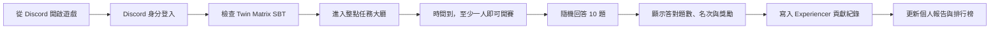

# twin3 Community Mission 產品規劃書

版本：V1  
產品終局：Discord 內的 twin3 多人知識遊戲  
目前階段：公開 Web 試玩版

## 1. 產品一句話

Community Mission 是一個結合 Twin Matrix 世界觀、知識問答、即時競賽與 Experiencer `$PoC` 獎勵的 Discord 遊戲。

玩家使用 Discord 身分登入，在固定開放時間進入任務大廳，每場回答 10 題；即使只有一位玩家，也能正常開賽。

## 2. 目前真實狀態

| 項目 | 現況 |
|---|---|
| 公開試玩 | 已上線 |
| 題庫 | **5 題** |
| 每場題數 | **5 題，固定題目** |
| Discord 登入 | 尚未完成 |
| 真實玩家連線 | 尚未完成，目前為模擬房間 |
| 真實排行榜 | 尚未完成 |
| `$PoC` 結算 | 尚未完成，目前只顯示模擬獎勵 |
| Discord Activity | 尚未完成 |
| 後台題庫與獎勵設定 | 尚未完成 |

公開試玩網址：

https://twin3-community-mission.mingwen.chatgpt.site

## 3. 正式版產品目標

### 題庫規模

- 完整題庫最多 **200 題**。
- 每位玩家可接觸的個人題目池最多 **30 題**。
- 每場從玩家尚未完成或需要複習的題目中抽出 **10 題**。
- 不提供練習模式；所有正式作答都屬於 Community Mission。
- 題目、選項、正確答案與解析由後台管理。

### 開賽方式

- 每個整點開放一場任務。
- 玩家可在開賽前進入大廳。
- 時間到即開賽。
- **只有一位玩家也能玩**，不因人數不足取消。
- 多人同場時顯示即時作答與名次變化。

### 身分方式

- 進入正式比賽前必須使用 Discord 登入。
- 顯示玩家 Discord 頭像與名稱。
- Discord UID 是遊戲紀錄、排行榜與 `$PoC` 歸因的主要識別。
- 玩家必須持有 Twin Matrix SBT，才能領取正式 `$PoC`。
- 沒有 SBT 的玩家可以完成遊戲，但獎勵保持不可領取狀態，並提供取得 SBT 的入口。

## 4. 玩家流程

## 5. 單場遊戲流程

### 進入大廳

玩家看到：

- Discord 頭像與名稱。
- 下一場開始時間。
- 已進入的玩家。
- 本場共 10 題。
- 可獲得的最高 `$PoC`。
- 音樂與音效控制。

### 倒數開賽

- 3 秒 Twin Matrix 同步動畫。
- 顯示任務名稱與本場主題。
- 使用音樂、粒子與光效建立儀式感。

### 作答

每題包含：

- 題目分類。
- 四個選項。
- 限時倒數。
- 目前題數，例如 `Question 4 / 10`。
- 即時累積答對數。
- 答題後顯示正確答案，但不在比賽中展示完整解析。

### 結算

玩家看到：

- 答對題數。
- 本場名次。
- 本場獲得的 Experiencer `$PoC`。
- 累積 Experiencer `$PoC`。
- 本場錯題解析。
- 下一場開放時間。
- 排行榜入口。

## 6. 題目分配

### 題庫結構

每題至少包含：

- 題目 ID。
- 分類。
- 難度。
- 題目文字。
- 四個選項。
- 正確答案。
- 答案解析。
- 啟用狀態。
- 版本與更新時間。

### 個人 30 題池

- 系統從完整 200 題中，為每位玩家建立最多 30 題的接觸池。
- 每場抽取 10 題。
- 優先抽取未回答過的題目。
- 已答錯題目可在後續場次重新出現。
- 同一場不得出現重複題目。
- 玩家完成 30 題後，可依錯題、題目版本與營運活動重新輪替。

## 7. `$PoC` 獎勵

### 歸屬

所有 Community Mission 獎勵歸入：

> **Experiencer `$PoC`**

### 後台設定

管理員可設定：

- 每場題數。
- 每題答對獎勵。
- 每場最高獎勵。
- 每日或每週可結算場次。
- 活動期間的額外獎勵。
- 題庫與題目啟用範圍。

### 結算原則

- 只有答對才產生 `$PoC`。
- 同一場、同一位玩家、同一題只能結算一次。
- 重整頁面、重送請求或重新登入不得重複發放。
- 未持有 SBT 的獎勵不得直接寫入可領取餘額。
- 每次結算都必須保留場次、題目、答案與事件編號。

## 8. 排行榜

正式版提供：

- 單場排行榜。
- 每週排行榜。
- 歷史累積排行榜。
- 個人答題紀錄。
- 正確率與完成題數。
- Experiencer `$PoC` 累積量。

排行榜以 Discord 身分呈現：

- Discord 頭像。
- Discord 顯示名稱。
- 名次。
- 答對題數。
- `$PoC`。

## 9. Discord 遊戲終局

最終產品不是傳統 Discord 訊息機器人，而是 **Discord Activity**：

- 玩家從 Discord 頻道或 Activity Launcher 直接開啟。
- 遊戲在 Discord 內以完整互動畫面運行。
- 自動取得目前 Discord 使用者與所在伺服器環境。
- 邀請同頻道成員進入同一任務房間。
- 遊戲結果同步到 twin3 的 Experiencer 系統。
- Lucy 可在指定 PoC Log 顯示重要任務完成事件。

Discord 斜線指令只作為入口與查詢，不承擔主要遊戲 UI。

## 10. 管理後台

管理員需要：

- 新增、編輯、停用題目。
- 批次匯入題庫。
- 設定每場題數與時間。
- 設定答對獎勵。
- 查看場次與玩家紀錄。
- 撤銷異常結算。
- 查看疑似重複帳號或自動作答。
- 預覽題目與完整遊戲流程。

所有後台變更保留操作者與時間紀錄。

## 11. 防作弊

- Discord UID、SBT 與 twin3 identity 三者對齊。
- 伺服器決定題目與正確答案，前端不保存完整題庫答案。
- 每場題目順序與選項順序可隨機。
- 每次結算使用唯一事件 ID。
- 限制作答速度與重複請求。
- 記錄異常準確率、異常反應時間與大量帳號共用環境。
- 可標記人工審查，但不可靜默扣除已結算資料。

## 12. 開發階段

### Phase 1：完整 Web 遊戲

完成標準：

- Discord 登入。
- 200 題後台資料結構。
- 每人 30 題池。
- 每場 10 題。
- 真實場次與單人開賽。
- 正式結果紀錄。

### Phase 2：Experiencer 整合

完成標準：

- SBT eligibility。
- 冪等 `$PoC` 結算。
- 個人報告。
- 排行榜。
- Discord 通知。

### Phase 3：Discord Activity

完成標準：

- Discord Embedded App SDK。
- Discord 內登入與房間同步。
- 同頻道邀請。
- Discord Activity 正式發佈準備。
- 通過 Discord 所需的應用程式設定與審查。

## 13. 產品驗收標準

正式版必須做到：

1. 一人也能準時開賽。
2. 每場正確抽出 10 題且不重複。
3. 每人最多接觸 30 題的學習範圍。
4. Discord 身分、SBT 與獎勵歸因一致。
5. 同一答案事件不會重複發放 `$PoC`。
6. 玩家能看到題目、結果、解析與排行榜。
7. 管理員能調整題目與獎勵，不需修改程式。
8. 最終可直接在 Discord 內作為完整遊戲運行。
